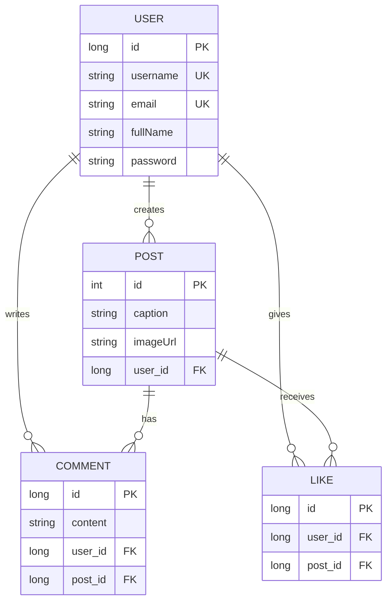

# Social Media Backend API - Minor Project 2

A Spring Boot REST API for a social media platform with features like posts, comments, and likes.

## Project Overview

This is **Minor Project 2** - a comprehensive backend system for a social media application built with Spring Boot, Jakarta Persistence, and PostgreSQL. The project demonstrates core concepts of REST API development, database relationships, validation, and error handling.

## Entity Relationship Diagram



## Project Architecture

### Folder Structure

```txt
src/main/java/org/example/socialmediabe/
├── controller/           # REST API endpoints
│   ├── UserController.java
│   ├── PostController.java
│   ├── CommentController.java
│   └── LikeController.java
├── model/               # Entity classes with JPA annotations
│   ├── User.java
│   ├── Post.java
│   ├── Comment.java
│   └── Like.java
├── repository/          # Spring Data JPA repositories
│   ├── UserRepo.java
│   ├── PostRepo.java
│   ├── CommentRepo.java
│   └── LikeRepo.java
├── service/            # Business logic layer
│   ├── UserService.java
│   ├── PostService.java
│   ├── CommentService.java
│   └── LikeService.java
└── SocialMediaBeApplication.java
```

## Topics & Annotations Covered

### 1. **User Model** (`User.java`)

- **@Entity**: Marks class as JPA entity
- **@Table**: Specifies database table name
- **@Id & @GeneratedValue**: Primary key with auto-increment strategy
- **@Column**: Defines column constraints (nullable, unique, length)
- **@NotBlank**: Ensures field is not empty or whitespace
- **@Size**: Validates string/collection length
- **@Pattern**: Regex-based validation for username format
- **@Email**: Validates email format (RFC 5322)
- **@Getter & @Setter**: Lombok annotations for automatic getters/setters
- **@NoArgsConstructor & @AllArgsConstructor**: Lombok annotations for constructors

### 2. **Post Model** (`Post.java`)

- **@ManyToOne & fetch = FetchType.LAZY**: Many posts belong to one user; defers user data loading until explicitly requested
- **@JoinColumn**: Creates foreign key relationship to users table
- **@OneToMany**: One post has many comments and likes
- **@CascadeType.ALL**: Propagates operations (delete, persist) to related entities
- **@orphanRemoval = true**: Automatically deletes related entities when removed from collection
- **@NotNull**: Validates relationship reference exists

### 3. **Comment Model** (`Comment.java`)

- **@NotBlank & @Size**: Content validation (1-1000 characters)

### 4. **Like Model** (`Like.java`)

### 5. **Controller Layer** (`UserController.java`)

- **@RestController**: Marks class as REST API controller (returns JSON)
- **@RequestMapping**: Base path for all endpoints
- **@PostMapping/@GetMapping/@DeleteMapping**: HTTP method mappings
- **@Valid**: Triggers validation on request body
- **@RequestBody**: Converts incoming JSON to Java object
- **@PathVariable**: Extracts parameter from URL path
- **ResponseEntity**: Wraps response with HTTP status code
- **HttpStatus**: Standard HTTP status codes (200 OK, 201 CREATED, 404 NOT_FOUND, 204 NO_CONTENT)

## API Endpoints

### User Management

```txt
POST   /api/users                          - Create user
GET    /api/users/{email}                  - Get user by email
```

### Post Management

```txt
POST   /api/posts                          - Create post
GET    /api/posts                          - Get all posts
GET    /api/posts/{id}                     - Get post by ID
GET    /api/posts/user/{userId}            - Get posts by user
DELETE /api/posts/{id}                     - Delete post
```

### Comment Management

```txt
POST   /api/comments                       - Add comment
GET    /api/comments/post/{postId}         - Get comments for post
DELETE /api/comments/{id}                  - Delete comment
```

### Like Management

```txt
POST   /api/likes                          - Like post
DELETE /api/likes/{id}                     - Unlike post
```

## Technologies Used

- **Java 17**: Programming language
- **Spring Boot 4.0.2**: Framework
- **Spring Data JPA**: ORM and database abstraction
- **PostgreSQL**: Relational database
- **Jakarta Validation (Bean Validation)**: Input validation
- **Lombok**: Reduces boilerplate code
- **Maven**: Build tool

## Getting Started

### Prerequisites

- Java 17 or higher
- PostgreSQL database
- Maven 3.6+

### Setup

1. **Clone the repository**

2. **Configure database** (`src/main/resources/application.properties`)

   ```properties
   spring.datasource.url=jdbc:postgresql://localhost:5432/social_media_db
   spring.datasource.username=your_username
   spring.datasource.password=your_password
   spring.jpa.hibernate.ddl-auto=update
   ```

3. **Build and run**

4. **Server runs on** `http://localhost:8080`

## Testing with Postman

You can test the API using the Postman collection

**[Social Media API Postman Collection](https://dark-eclipse-727260.postman.co/workspace/lpu~46ad23b4-3ff7-45e2-880d-6146382f44a4/collection/32782602-f2a835c6-ba70-4d83-bfd8-9fa2020822f5?action=share&creator=32782602)**

 Import `Social_Media_API_Postman_Collection.json` into Postman

## Topics Covered

✅ **JPA/ORM Concepts**

- Entity relationships (One-to-Many, Many-to-One)
- Cascade operations and orphan removal
- LAZY vs EAGER loading strategies
- Foreign key constraints

✅ **Validation**

- @NotBlank, @NotNull, @Email, @Pattern, @Size annotations
- Custom validation messages
- Global exception handling for validation errors

✅ **REST API Design**

- Proper HTTP methods (GET, POST, DELETE)
- HTTP status codes (200, 201, 204, 404, 400)
- ResponseEntity for flexible response handling
- Request/Response mapping with @RequestBody, @PathVariable

✅ **Spring Boot Features**

- Dependency injection with @RequiredArgsConstructor (Lombok)
- Spring Data JPA repositories
- Global exception handling with @RestControllerAdvice
- Service layer for business logic separation

✅ **Database Design**

- Relational database schema
- Primary and foreign keys
- Unique constraints
- NOT NULL constraints

## Topics Students Can Explore & Add

### 1. **Authentication & Authorization**

- Add JWT (JSON Web Tokens) for user authentication
- Implement Spring Security for role-based access control
- Create login/registration endpoints
- Protect endpoints with @PreAuthorize

### 2. **Advanced Validation**

- Custom validation annotations
- Cross-field validation
- Conditional validation based on business rules

### 3. **Error Handling Enhancements**

- Custom exception classes
- More detailed error responses with timestamps
- Error tracking and logging with SLF4J

### 4. **Pagination & Sorting**

- Implement Pageable for large result sets
- Add sorting options for posts and comments
- Limit results with @PageableDefault

### 5. **Search & Filtering**

- Search posts by caption or keywords
- Filter by date range
- Advanced query methods in repositories

### 6. **File Upload**

- Allow users to upload profile pictures
- Store post images in file system or cloud storage (AWS S3)
- Image validation and compression

### 7. **Follow/Unfollow System**

- Add user follow relationships
- Create feed based on followed users
- Implement notifications for follows

### 8. **Notifications**

- Notify users when their post is liked or commented
- Email notifications
- WebSocket for real-time notifications

### 9. **Caching**

- Add @Cacheable annotations for frequently accessed data
- Implement Redis or Caffeine for caching
- Cache invalidation strategies

### 10. **API Documentation**

- Add Swagger/OpenAPI documentation
- Auto-generate API docs with @ApiOperation, @ApiParam
- Generate client SDKs from API specification

### 11. **Testing**

- Unit tests with JUnit 5 and Mockito
- Integration tests with @SpringBootTest
- Test database using H2 or Testcontainers

### 12. **Performance Optimization**

- Database query optimization
- N+1 query problem prevention with proper joins
- Implement query caching
- Monitor and profile application performance

### 13. **Soft Delete**

- Implement soft deletes for posts/comments (keep data, mark as deleted)
- Add timestamp fields for created_at and updated_at
- Implement domain events for audit trails

### 14. **Rate Limiting**

- Implement API rate limiting per user
- Use Redis or in-memory store for rate limit tracking
- Return proper HTTP 429 (Too Many Requests) status

### 15. **Internationalization (i18n)**

- Support multiple languages for error messages
- Locale-based responses
- Use message properties files

## Validation Examples

### Username Validation

```txt
- Must be 3-20 characters
- Only alphanumeric, dots, hyphens, underscores
- Must be unique
```

### Email Validation

```txt
- Must follow RFC 5322 standard
- Must be unique across system
```

### Post Caption Validation

```txt
- Must not be empty
- Must be 1-1000 characters
```

### Comment Validation

```txt
- Content cannot be blank
- Must be 1-1000 characters
- User and Post must exist
```

## Best Practices Demonstrated

1. **Layered Architecture**: Separation of concerns (Controller → Service → Repository)
2. **DRY Principle**: Validation and error handling centralized
3. **RESTful Design**: Proper use of HTTP methods and status codes
4. **Database Relationships**: Correct mapping of entity relationships
5. **Lombok Usage**: Reduces boilerplate code
6. **Global Exception Handling**: Consistent error responses
7. **Lazy Loading**: Optimizes database queries

## Troubleshooting

### Database Connection Issues

- Verify PostgreSQL is running
- Check credentials in application.properties
- Ensure database exists

### Validation Errors

- Check request body format matches model
- Ensure all @NotBlank/@NotNull fields are provided
- Review error response for specific field errors

### Port Already in Use

- Change server port in application.properties: `server.port=8081`

## License

This project is for educational purposes as part of Minor Project 2.

## Support

For questions or issues, refer to the code comments and documentation in the respective model and controller classes.

---

**Happy Learning!** 🚀
